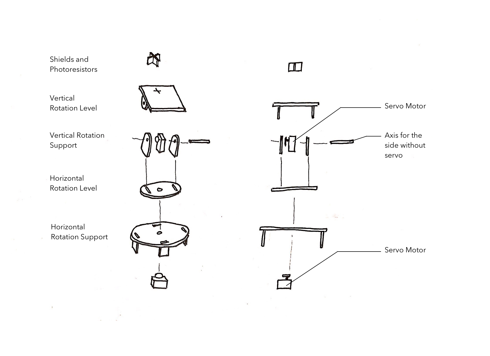
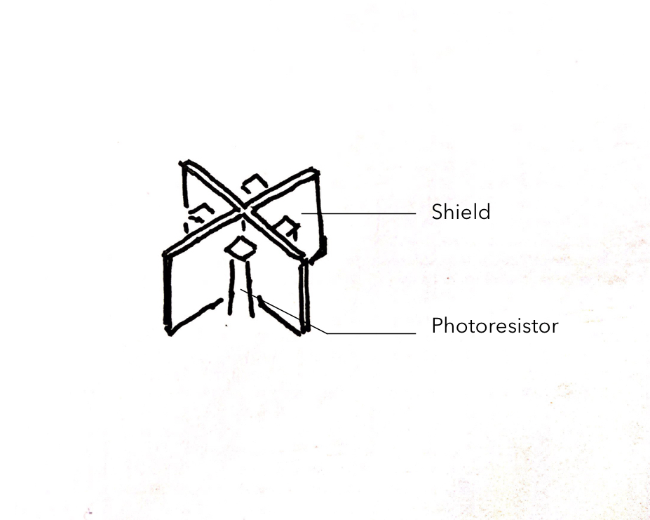
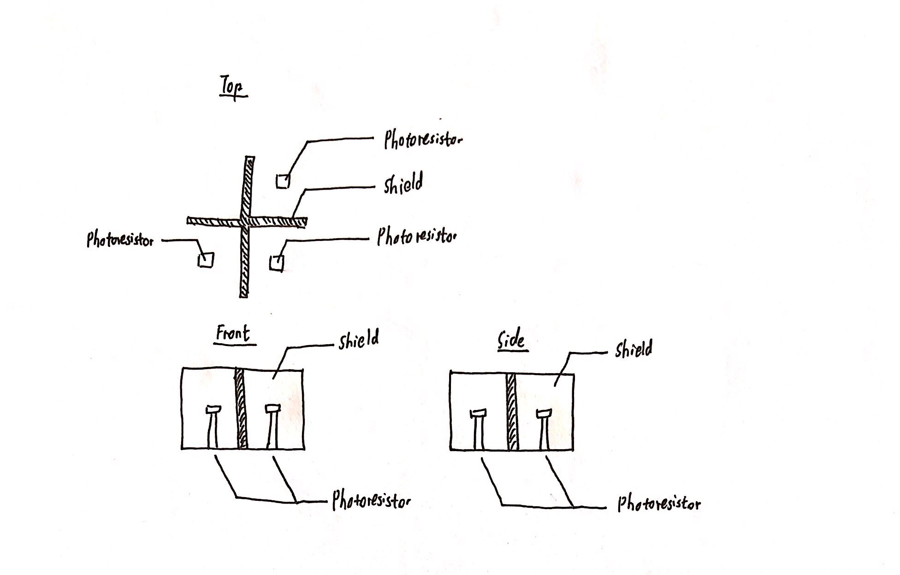
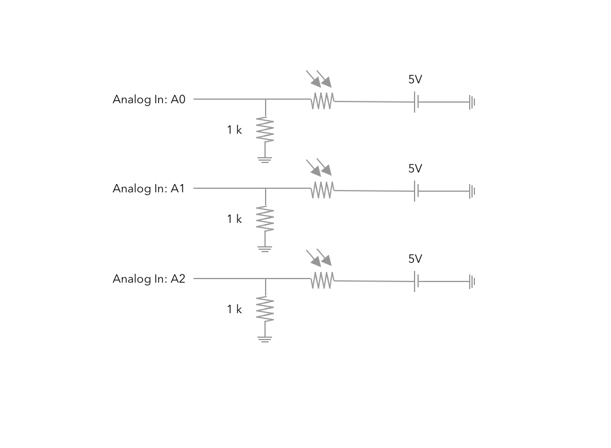
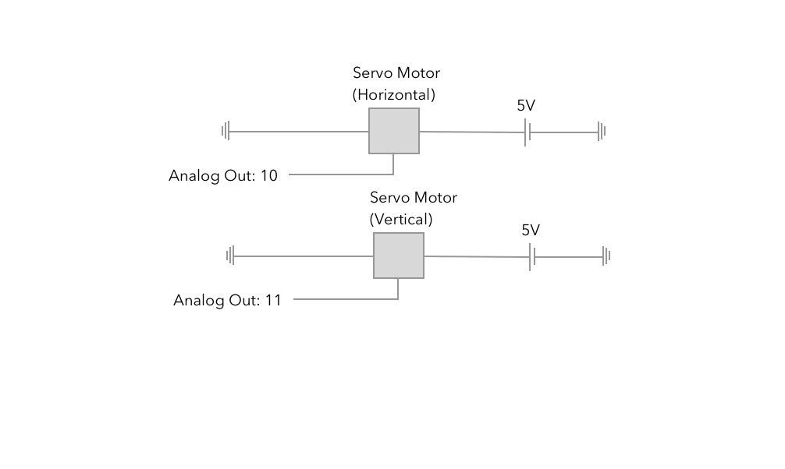

**IMPORTANT:** This page is still under construction. Thank you for your understanding.

# Solar Tracker for Device Charging Station

This is a solar tracker that will automatically track the light source in both vertical and horizontal directions. One of the main keys for automation is the physical design of shield and photoresistors.

* Laser Cut Files - find them [here](https://github.com/YiChiMa/Solar-Tracker/tree/master/LaserCut).


## Mechanical Design

##### The Sketch of Overall Mechanical Design



The mechanical design mainly allows the solar panel to move in both vertical and horizontal directions. Both horizontal and vertical rotation servos can move the panel in 180 degrees, which means that the panel can receive light from everywhere on the top.  

## The Shield and the Photoresistors

##### Simple 3D sketch



The shield is mounted on the solar panel plane (vertical rotation level). In this design. Only three photoresistors are used since three points define a plane.

This is the simple 3D sketch demonstrating the shield acting as a mechanism to report if the solar panel
The shield will block some light projecting on one of the photoresistors if the solar panel plane is tilted.

As one of the photoresistors does not receive the full light, its resistance will decrease. This will signal the program to adjust the angle in either vertical or horizontal directions. If all of the three photoresistors receive the same amount of light, the adjustment will stop, which means that the solar panel plane is receiving most of the light.

This is a more detailed sketch.




## Schematics
##### Input Electronic Schematics


The microcontroller will read the values of the photoresistors and decide what to adjust.

##### Output Electronic Schematics


The microcontroller will signify which servo motor to move and when to stop moving.

## Code

This is the arduino code with extension ``.ino``

```
#include <Servo.h>

int sensorValue1 = 0;
int sensorValue2 = 0;
int sensorValue3 = 0;
int servoValue = 0;
int xAngle = 10;  //Initialize Horizontal Angle
int yAngle = 50;  //Initialize Vertical Angle
int tolerance = 30;
int difference2_1;
int difference3_1;

Servo servo1;
Servo servo2;

void setup() {
  Serial.begin(9600);
  servo1.attach(10);
  servo2.attach(11);
}


void loop() {
  sensorValue1 = analogRead(A0);
  sensorValue2 = analogRead(A1);
  sensorValue3 = analogRead(A2);

  delay(500);
  servo1.write(xAngle);
  servo2.write(yAngle);

  difference2_1 = abs(sensorValue2 - sensorValue1);
  while(difference2_1 > tolerance && 5 < xAngle && xAngle < 170){  

    if (sensorValue1 > sensorValue2 && xAngle < 170){
      xAngle = xAngle + 5;   
      servo1.write(xAngle);
      delay(50);
    }
    if (sensorValue2 > sensorValue1 && xAngle > 5){
      xAngle = xAngle - 5;
      servo1.write(xAngle);
      delay(50);
    }
    sensorValue1 = analogRead(A0);
    sensorValue2 = analogRead(A1);
    sensorValue3 = analogRead(A2);
    difference2_1 = abs(sensorValue2 - sensorValue1);

    delay(500);
  }

  difference3_1 = abs(sensorValue3 - sensorValue1);
  while(difference3_1 > tolerance && 40 < yAngle && yAngle < 170 ){
    if (sensorValue3 > sensorValue1 && yAngle < 170){
      yAngle = yAngle + 5;     
      servo2.write(yAngle);
      delay(50);
    }
    if (sensorValue1 > sensorValue3 && yAngle > 40){
      yAngle = yAngle - 5;
      servo2.write(yAngle);
      delay(50);
    }
    sensorValue1 = analogRead(A0);
    sensorValue2 = analogRead(A1);
    sensorValue3 = analogRead(A2);
    difference3_1 = abs(sensorValue3 - sensorValue1);

    delay(500);
  }
}
```
