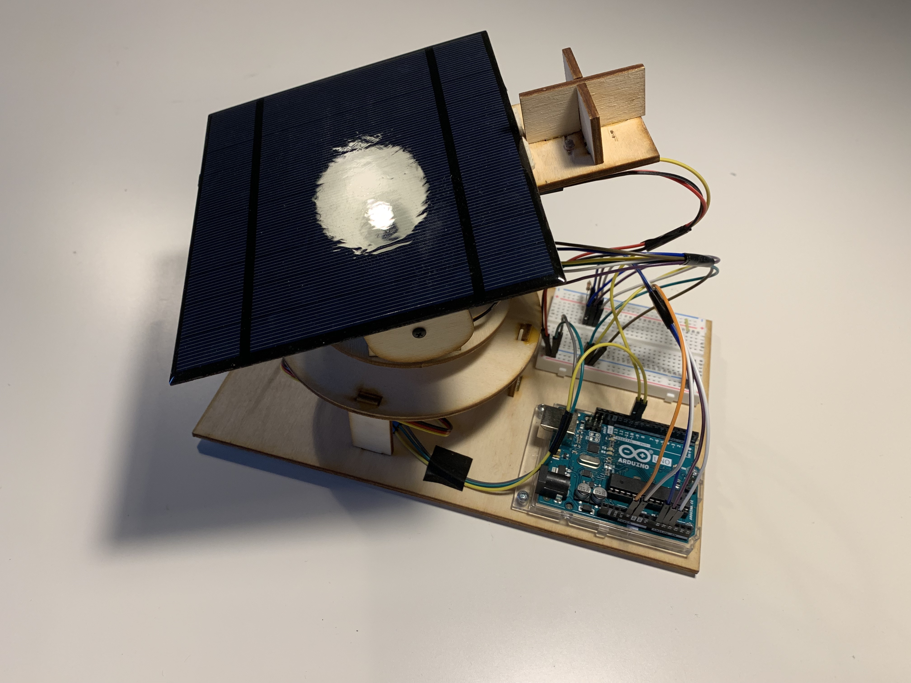
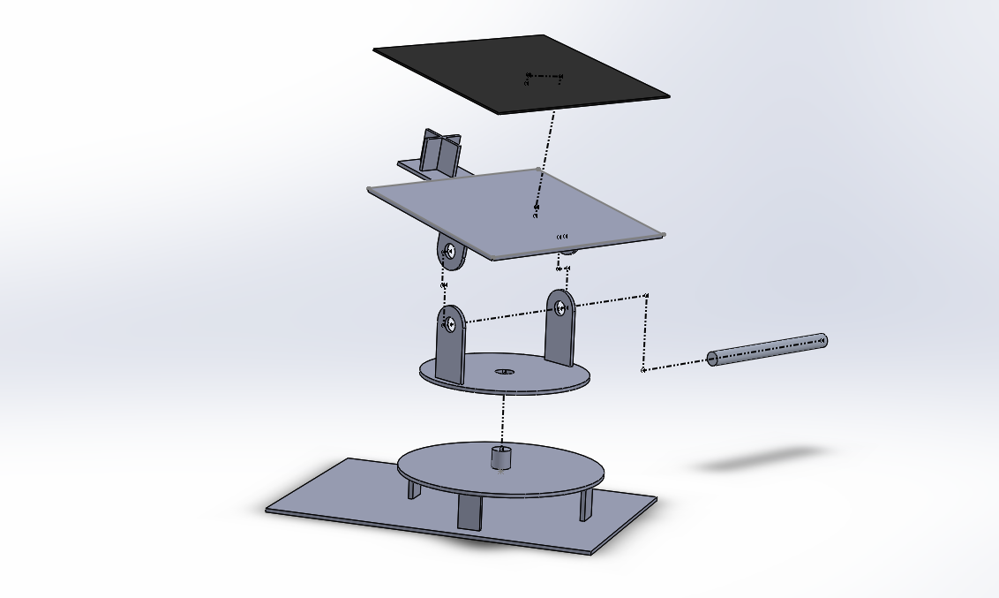
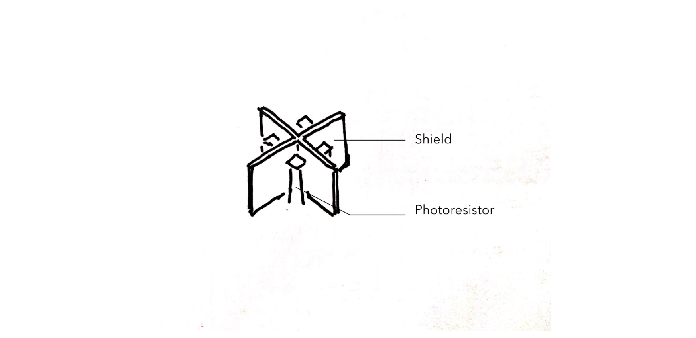

# Solar Tracker for Device Charging Station

This is a solar tracker experimenting with a novel tracking system for the light source in both vertical and horizontal directions. One of the main keys to automation is the physical design of shield and photoresistors.

I used Solidworks to work on the model and prototyped it with the laser cutter.

* Laser Cut Files - find them [here](https://github.com/YiChiMa/Solar-Tracker/tree/master/LaserCut).




## Mechanical Design

##### The Sketch of Overall Mechanical Design


##### Exploded View for the Model



The mechanical design mainly allows the solar panel to move in both vertical and horizontal directions. Both horizontal and vertical rotation servos can move the panel in 180 degrees, which means that the panel can receive light from everywhere on the top.  

## The Shield and the Photoresistors

##### Simple sketch



The shield and the photoresistor sensors on the top of the solar panel are used as a mechanism to report if the solar panel is directly aimed at the light source or not.

The shield is mounted on the top of the solar panel plane (vertical rotation level). In this design, three photoresistors are used since three points define a plane.

If the solar panel plane is tilted, the shield will block some light projecting on one of the photoresistors. Thus, the photoresistor would receive less light so it signals the microcontroller to adjust the angle through the servo motor. If all of the three photoresistors receive the same amount of light, it means that no photoresistor is blocked by the shield. The microcontroller will note that the solar panel plane receives the most of the light from this particular angle. Then, the servo motor will stop adjusting the angle.


## Schematics
##### Input Electronic Schematics


The microcontroller will compare the light intensity from each photoresistor.

##### Output Electronic Schematics


The microcontroller will signify which servo motor to move and when to stop moving.

## Code

This is the Arduino code with extension ``.ino``

```
#include <Servo.h>

int sensorValue1 = 0;
int sensorValue2 = 0;
int sensorValue3 = 0;
int servoValue = 0;
int xAngle = 10;  //Initialize Horizontal Angle
int yAngle = 50;  //Initialize Vertical Angle
int tolerance = 30;
int difference2_1;
int difference3_1;

Servo servo1;
Servo servo2;

void setup() {
  Serial.begin(9600);
  servo1.attach(10);
  servo2.attach(11);
}


void loop() {
  sensorValue1 = analogRead(A0);
  sensorValue2 = analogRead(A1);
  sensorValue3 = analogRead(A2);

  delay(500);
  servo1.write(xAngle);
  servo2.write(yAngle);

  difference2_1 = abs(sensorValue2 - sensorValue1);
  while(difference2_1 > tolerance && 5 < xAngle && xAngle < 170){  

    if (sensorValue1 > sensorValue2 && xAngle < 170){
      xAngle = xAngle + 5;   
      servo1.write(xAngle);
      delay(50);
    }
    if (sensorValue2 > sensorValue1 && xAngle > 5){
      xAngle = xAngle - 5;
      servo1.write(xAngle);
      delay(50);
    }
    sensorValue1 = analogRead(A0);
    sensorValue2 = analogRead(A1);
    sensorValue3 = analogRead(A2);
    difference2_1 = abs(sensorValue2 - sensorValue1);

    delay(500);
  }

  difference3_1 = abs(sensorValue3 - sensorValue1);
  while(difference3_1 > tolerance && 40 < yAngle && yAngle < 170 ){
    if (sensorValue3 > sensorValue1 && yAngle < 170){
      yAngle = yAngle + 5;     
      servo2.write(yAngle);
      delay(50);
    }
    if (sensorValue1 > sensorValue3 && yAngle > 40){
      yAngle = yAngle - 5;
      servo2.write(yAngle);
      delay(50);
    }
    sensorValue1 = analogRead(A0);
    sensorValue2 = analogRead(A1);
    sensorValue3 = analogRead(A2);
    difference3_1 = abs(sensorValue3 - sensorValue1);

    delay(500);
  }
}
```
